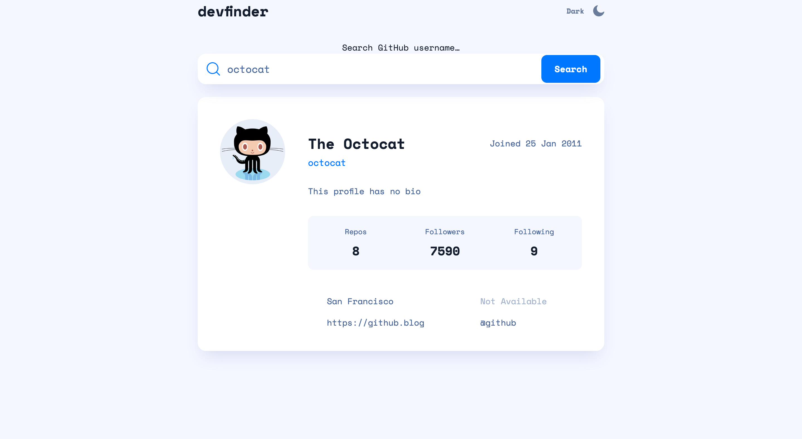

# Frontend Mentor - GitHub user search app solution

This is a solution to the [GitHub user search app challenge on Frontend Mentor](https://www.frontendmentor.io/challenges/github-user-search-app-Q09YOgaH6).
Frontend Mentor challenges help you improve your coding skills by building
realistic projects.

## Table of contents

- [Overview](#overview)
  - [The challenge](#the-challenge)
  - [Screenshot](#screenshot)
  - [Links](#links)
- [My process](#my-process)
  - [Built with](#built-with)
  - [What I learned](#what-i-learned)
  - [Challenges](#challenges)
  - [Testing](#testing)
  - [Continued development](#continued-development)
  - [Useful resources](#useful-resources)
- [Author](#author)
- [Acknowledgments](#acknowledgments)

## Overview

### The challenge

Users should be able to:

- View the optimal layout for the app depending on their device's screen size
- See hover states for all interactive elements on the page
- Search for GitHub users by their username
- See relevant user information based on their search
- Switch between light and dark themes

### Screenshot




### Links

- [Live Site URL](https://subtle-muffin-50b8a2.netlify.app/)

## My process

### Built with

- Semantic HTML5 markup
- CSS
- CUBE CSS methodology & BEM naming convention
- Javascript
- JSDocs & VS Code's built in type checker
- Vitest
- Gulp

### What I learned

- How to test front end web applications using vitest and happy-dom.
  In order to be able to test the front end I had to import a library
  called happy-dom and I used it to set up a virtual dom in which I
  could call methods like `querySelector`

```javascript
import { describe, expect, it, vi, beforeEach } from 'vitest';
import { Window } from 'happy-dom';

import fs from 'fs';
import path from 'path';

// set up virtual dom
const htmlDocPath = path.join(process.cwd(), 'index.html');
const htmlDocumentContent = fs.readFileSync(htmlDocPath).toString();

const window = new Window();
const document = window.document;
vi.stubGlobal('document', document);

beforeEach(() => {
  document.body.innerHTML = '';
  document.write(htmlDocumentContent);
});
```

- Adding Parameters to event listener call-backs.
  I normally don't do things in an _object oriented_ way thus I hardly
  ever use the `bind` method. When looking up how to add parameters to
  my callback functions, I did learn about this method and I've come to prefer it.

```javascript
// TOGGLE THEME ON CLICK
inputs.forEach((input) => {
  input.addEventListener('click', handleClick.bind(null, body, labels));
});
```

- Changing the content value of a pseudo-element so that it matches a data attributes
  value. Rather than hiding my error message and displaying it, I left it there and
  simply had its content be empty and dynamically updated it. This way I could show
  different error messages if I had wanted to.

```html
<span class="[ search-form__error ]" aria-live="polite" data-content=""></span>
```

```css
.search-form__error::after {
  content: attr(data-content);
}
```

```javascript
errorMsg.dataset.content = 'No Results';
```

- An interesting way of cash-busting by appending a new querystring to
  my stylesheet and scripts. It turns out that I can append whatever parameters
  I want to the end of my file paths and it won't affect my code. If I change
  that queryString though, the browser will treat that resource as something
  new even if no changes have been made to the file. I used gulp to dynamically
  update that parameter

  ```html
  <link rel="stylesheet" href="./src/css/output/styles.css?cb=123" />
  ```

- How to refactor my functions until they're easily testable. If I attempted
  to test my function and I found it to be a pain, it probably meant that it could
  be refactored
- How to document my code using JSDocs
- How to use the formData api
- How to create an accessible toggle switch using 2 radio inputs
- How to create an accessible search bar
- About adding aria-live regions for error messages
- About gitattributes and why to use them
- About having a .nvmrc file
- How to test with a host of tools

### Challenges

- For my toggle, getting the the checked input to disappear and leaving the
  un-checked one on click
  - Following the CUBE methodology was very helpful here, I used data attributes
    and added the corresponding style into my exceptions.css. It was much easier
    and neater to work with than toggling the screen reader class
- Testing frontend code, it was hard to work with the DOM, even if I mocked the
  window object, when the code ran through my functions, it would give me an error
  about some DOM object not existing
  - I managed to fix it by mocking the function within the test file so it could
    use the window object I imported from `happy-dom`
  - I determined what I didn't need to test and used empty spy functions for those
    things
- The github search api gave the user location but in the challenge, it was
  suppose to be a link. Instead of using another api, I simply used this bit
  of code `https://www.google.com/map?q=${location}` so that the user
  would be taken to google maps with the name of the location
  appended to the query string
  - I used the same solution for their twitter account
- When using `aria-live="polite"` for my error message, it wouldn't announce
  the error message on firefox. In order to fix this I had its aria-describedby
  to be connected to its input
- Using gulp, its one thing to copy and paste someone elses code and its
  another thing to have it be useable for your own project structure

### Testing

I tested my app by:

- Using a Phone (_since on touch devices, they offer virtual keyboards_)
- Using a [Html validator](https://validator.w3.org/)
- Using a Screen reader
- Using Chrome extensions

  - Css unstyler
  - Wave
  - Axe
  - Lighthouse
  - PSI
  - Accessibility Insights for Web
  - Responsive Viewer (_for viewing my app on different devices_)

- Vitest
- Having other developers try out my toggle
- Navigating using a keyboard
- Viewing in both landscape mode as well as portrait
- Zooming in on the screen to 200%
- Zooming in to 400%

### Continued development

- Adding more accessible colour options
- Using the preferred-colour scheme of the user so that they don't have to manually
  toggle the colour mode, it will be based on their preferences
- Using netlify's serverless edge functions and env variables so I can store a
  personal access token for the github api thus vastly increasing the limit to which
  requests can be made

### Useful resources

- These 2 resources for .gitattributes,
  - [dev.to](https://dev.to/deadlybyte/please-add-gitattributes-to-your-git-repository-1jld)
  - [github/vanzetsetia](https://github.com/vanzasetia/officelite-coming-soon-site/blob/main/.gitattributes)
- Brad Traversy's crash course on [jsdocs](https://www.youtube.com/watch?v=YK-GurROGIg&t=1s)
- [Learning about nvmrc](https://medium.com/@faith__ngetich/locking-down-a-project-to-a-specific-node-version-using-nvmrc-and-or-engines-e5fd19144245)
- [For adding arguments to event listeners](https://ultimatecourses.com/blog/avoiding-anonymous-javascript-functions)
- [Learning about forms in general](https://web.dev/learn/forms/form-element/)
- [Github user name rules](https://github.com/shinnn/github-username-regex)
- [Accessible Search Input](https://www.a11ymatters.com/pattern/accessible-search/)
- [Github search api](https://docs.github.com/en/rest/search)
- [How to change the value of a pseudo element in javascript](https://stackoverflow.com/questions/5041494/selecting-and-manipulating-css-pseudo-elements-such-as-before-and-after-usin)
- [coder coder's](https://www.youtube.com/@TheCoderCoder) tutorial on gulp
  helped quite a bit, especially on cash-busting

## Author

- [Portfolio Website](https://daniel-arzani-portfolio.netlify.app/)
- [Frontend Mentor Profile](https://www.frontendmentor.io/profile/DanielArzani)

## Acknowledgments

I originally used the querystring `https://www.google.com/search?q={location}`
but one of the admins, [Grace](https://www.frontendmentor.io/profile/grace-snow)
gave me a better idea and said to use `https://www.google.com/maps?q={location}`
instead of search. So instead of re-directing someone to google search, they're re-directed
to google maps instead
